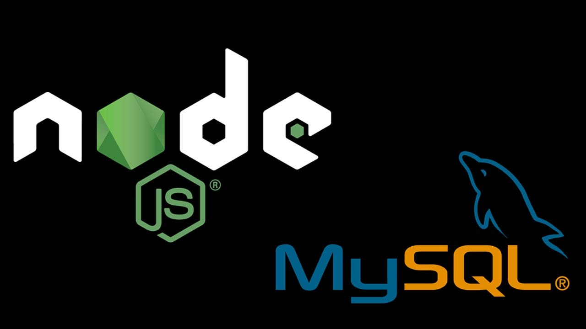

# CURSO DE NODEJS COM MYSQL
👨‍⚖️NODEJS É UM SOFTWARE QUE PERMITE A EXECUÇÃO DO CÓDIGO JAVASCRIPT FORA DO NAVEGADOR WEB. MYSQL É UM SISTEMA DE GERENCIAMENTO DE BANCO DE DADOS, QUE UTILIZA A LINGUAGEM SQL COMO INTERFACE.

  

## CONCEITO:
O conceito de Node.js com MySQL envolve a combinação do ambiente de tempo de execução do Node.js com o sistema de gerenciamento de banco de dados relacional MySQL. Aqui está um resumo do conceito:

1. **Node.js**:
   - Node.js é um ambiente de tempo de execução de JavaScript do lado do servidor, construído sobre o motor V8 JavaScript da Google.
   - Ele permite que os desenvolvedores usem JavaScript para escrever aplicativos no lado do servidor, fornecendo um ambiente de programação assíncrono e orientado a eventos.

2. **MySQL**:
   - MySQL é um sistema de gerenciamento de banco de dados relacional amplamente utilizado, conhecido por sua confiabilidade, desempenho e facilidade de uso.
   - Ele oferece suporte a consultas SQL (Structured Query Language) para armazenar, recuperar, modificar e gerenciar dados.

3. **Integração do Node.js com MySQL**:
   - O Node.js pode se integrar facilmente ao MySQL usando bibliotecas de terceiros disponíveis no npm, como o "mysql" ou "mysql2".
   - Essas bibliotecas fornecem uma API para conectar-se ao banco de dados MySQL, enviar consultas SQL e manipular resultados.

4. **Operações Assíncronas e Não-Bloqueantes**:
   - Node.js opera em um modelo assíncrono e não bloqueante, o que significa que as operações de entrada/saída (I/O) não bloqueiam a execução do código.
   - Isso é especialmente útil ao lidar com consultas de banco de dados, pois permite que o Node.js continue a executar outras operações enquanto aguarda a resposta do MySQL.

5. **Consultas SQL Dinâmicas**:
   - No Node.js, você pode usar consultas SQL dinâmicas para interagir com o banco de dados MySQL.
   - As consultas podem ser construídas dinamicamente usando interpolação de string ou consultas preparadas para evitar ataques de injeção de SQL.

6. **Manipulação de Resultados**:
   - Após enviar uma consulta SQL para o MySQL, o Node.js pode manipular os resultados retornados, que geralmente são fornecidos como objetos JavaScript ou matrizes.
   - Os desenvolvedores podem percorrer os resultados, processá-los e usá-los conforme necessário em suas aplicações Node.js.

7. **Escalabilidade e Desempenho**:
   - A combinação do Node.js com o MySQL oferece escalabilidade e desempenho robustos para aplicativos da web, permitindo que eles lidem com grandes volumes de dados e cargas de tráfego simultâneas de forma eficiente.

## SUA HISTÓRIA:
1. **Origens do Node.js (2009)**:
   - Node.js foi oficialmente lançado em 2009 por Ryan Dahl como um ambiente de tempo de execução JavaScript do lado do servidor.
   - A motivação por trás do Node.js era criar um ambiente altamente eficiente e escalável para construir aplicativos de rede, especialmente aqueles que exigem muitas operações de entrada/saída (I/O).

2. **Adoção Rápida e Popularidade Crescente**:
   - O Node.js ganhou popularidade rapidamente devido ao seu modelo assíncrono e orientado a eventos, que o tornou ideal para lidar com operações de I/O intensivas, como acesso a bancos de dados, arquivos e chamadas de rede.

3. **Integração com MySQL**:
   - Com o crescimento da popularidade do Node.js, os desenvolvedores começaram a procurar maneiras de integrá-lo a sistemas de gerenciamento de banco de dados.
   - O MySQL, sendo um dos sistemas de banco de dados relacionais mais populares, tornou-se uma escolha natural para integração com o Node.js.

4. **Desenvolvimento de Bibliotecas e Drivers**:
   - Logo após o lançamento do Node.js, várias bibliotecas e drivers foram desenvolvidos para permitir a conexão e interação com o MySQL a partir do ambiente Node.js.
   - Bibliotecas populares, como "mysql" e "mysql2", foram criadas para facilitar o acesso ao MySQL a partir do Node.js.

5. **Expansão do Ecossistema**:
   - O ecossistema do Node.js cresceu rapidamente, com uma ampla gama de bibliotecas e ferramentas disponíveis no npm (Node Package Manager).
   - Isso incluiu pacotes específicos para integração com bancos de dados, como o MySQL, tornando ainda mais fácil para os desenvolvedores criar aplicativos que aproveitam a combinação de Node.js e MySQL.

6. **Adoção Corporativa e Casos de Uso Diversificados**:
   - Empresas de todos os tamanhos começaram a adotar o Node.js com MySQL para uma variedade de casos de uso, incluindo desenvolvimento de APIs, aplicativos da web em tempo real, processamento de eventos e muito mais.
   - A combinação de Node.js e MySQL provou ser particularmente eficaz para aplicativos que exigem escalabilidade, desempenho e manipulação eficiente de I/O.

7. **Desenvolvimento Contínuo e Aperfeiçoamento**:
   - Tanto o Node.js quanto o MySQL continuaram a evoluir ao longo dos anos, com novas versões trazendo melhorias de desempenho, segurança e novos recursos.
   - A comunidade de desenvolvedores em torno do Node.js e do MySQL permanece ativa, contribuindo com novas bibliotecas, ferramentas e recursos para aprimorar ainda mais a experiência de desenvolvimento.

## CARACTERÍSTICAS
### POSITIVAS:
1. **Eficiência de I/O Assíncrona**:
   - O Node.js é conhecido por sua eficiência no tratamento de operações de entrada/saída (I/O) devido ao seu modelo assíncrono e orientado a eventos.
   - Isso é especialmente útil ao lidar com operações de banco de dados, como consultas e atualizações, permitindo que o Node.js continue a executar outras tarefas enquanto aguarda a resposta do MySQL.

2. **Escalabilidade**:
   - Tanto o Node.js quanto o MySQL são altamente escaláveis, o que significa que podem lidar com grandes volumes de tráfego e dados sem comprometer o desempenho.
   - O Node.js pode ser facilmente escalado horizontalmente para lidar com várias solicitações simultâneas, enquanto o MySQL suporta replicação e clustering para distribuir a carga de trabalho.

3. **Desempenho**:
   - O Node.js é conhecido por seu desempenho rápido devido ao seu motor V8 JavaScript de alto desempenho.
   - Quando combinado com consultas eficientes e otimizadas no MySQL, os aplicativos Node.js podem oferecer tempos de resposta rápidos e uma experiência de usuário fluida.

4. **Facilidade de Desenvolvimento**:
   - Tanto o Node.js quanto o MySQL são fáceis de instalar, configurar e usar, tornando-os ideais para desenvolvedores de todos os níveis de habilidade.
   - O Node.js possui um ecossistema vibrante de módulos e pacotes no npm, facilitando a integração de bibliotecas e funcionalidades adicionais em aplicativos.

5. **Comunidade Ativa e Suporte**:
   - Tanto o Node.js quanto o MySQL têm comunidades de desenvolvedores ativas e vibrantes, oferecendo suporte, documentação e recursos abundantes.
   - Isso significa que os desenvolvedores podem encontrar ajuda facilmente, aprender com outros membros da comunidade e contribuir com seu próprio conhecimento e experiência.

6. **Compatibilidade e Portabilidade**:
   - O Node.js e o MySQL são compatíveis com uma ampla variedade de sistemas operacionais e plataformas, incluindo Windows, macOS e Linux.
   - Isso oferece flexibilidade aos desenvolvedores para escolher a plataforma que melhor atenda às suas necessidades e requisitos de implantação.

7. **Segurança**:
   - Tanto o Node.js quanto o MySQL têm recursos de segurança robustos para proteger contra ameaças comuns, como injeção de SQL e ataques de negação de serviço (DDoS).
   - Os desenvolvedores podem implementar práticas recomendadas de segurança e configurações para garantir a proteção adequada de seus aplicativos e dados.

### NEGATIVAS:
1. **Complexidade da Programação Assíncrona**:
   - O modelo de programação assíncrona do Node.js pode ser difícil de entender e de programar para desenvolvedores acostumados com a programação síncrona.
   - O uso excessivo de callbacks, promessas ou async/await pode levar a código complexo e difícil de manter.

2. **Possibilidade de Callback Hell**:
   - O encadeamento excessivo de callbacks assíncronos, conhecido como "callback hell", pode ocorrer quando não é feita uma gestão adequada do fluxo de controle em operações assíncronas, tornando o código difícil de ler e manter.

3. **Gestão de Conexões com o MySQL**:
   - O Node.js requer que os desenvolvedores gerenciem manualmente as conexões com o banco de dados MySQL, incluindo abertura, fechamento e reutilização de conexões.
   - Uma má gestão de conexões pode levar a vazamentos de memória ou esgotamento de recursos do banco de dados.

4. **Vulnerabilidades de Segurança**:
   - Assim como qualquer aplicativo web, os aplicativos Node.js com MySQL estão sujeitos a várias vulnerabilidades de segurança, como injeção de SQL, cross-site scripting (XSS) e ataques de negação de serviço (DDoS).
   - Os desenvolvedores devem implementar práticas de segurança adequadas, como sanitização de entrada de dados, autenticação e autorização, para proteger seus aplicativos e dados.

5. **Escalabilidade Vertical Limitada**:
   - Embora o Node.js seja altamente escalável horizontalmente, escalá-lo verticalmente (aumentando os recursos do servidor) pode ter limitações, especialmente em relação à capacidade de processamento de CPU e à memória disponível em um único servidor.

6. **Desempenho em Operações de CPU-Intensivas**:
   - O Node.js é otimizado para operações de I/O, mas pode não ser a melhor escolha para operações intensivas de CPU, como processamento de imagem ou cálculos matemáticos complexos.
   - Nessas situações, pode ser necessário considerar o uso de linguagens ou tecnologias alternativas para garantir um desempenho adequado.

7. **Documentação Fragmentada e Suporte Limitado**:
   - Embora tanto o Node.js quanto o MySQL tenham documentação abrangente, pode haver lacunas na documentação ou dificuldades em encontrar soluções para problemas específicos.
   - Além disso, o suporte para algumas funcionalidades ou integrações específicas pode ser limitado, especialmente para bibliotecas de terceiros.

8. **Curva de Aprendizado**:
   - Aprender a usar efetivamente o Node.js com o MySQL pode exigir uma curva de aprendizado significativa para desenvolvedores inexperientes ou novatos.
   - É necessário entender não apenas os princípios do Node.js e do MySQL individualmente, mas também como integrá-los efetivamente para criar aplicativos robustos e eficientes.

## SUBSIDIOS:
- [CURSO CRIADO PELO "PROFESSOR LOZANO"](https://youtube.com/playlist?list=PL1hl9qLyFtfDXY9NO8F3TnjxezKJ_1HlI&si=jRR0rrVw1WtSkcRo)
- [CURSO FEITO PELO VILHALVA](https://github.com/VILHALVA)
- [VEJA O CURSO DE NODEJS](https://github.com/VILHALVA/CURSO-DE-NODEJS)
- [VEJA O CURSO DE MYSQL](https://github.com/VILHALVA/CURSO-DE-MYSQL)
- [VEJA A SINTAXE](./SINTAXE.md)
